# Healthcare Full Project

A role-based Angular healthcare platform with operational flows for patients, doctors, and administrators.

## Overview

This project is built as a standalone Angular application with in-memory service state, role-based access control, and full feature coverage across scheduling, care communication, billing, operations, reminders, search UX, and analytics.

## Core Capabilities

- Role-authenticated access for patient, doctor, and admin users
- Guard-protected routes with role-aware redirects and admin override
- Doctor directory, detailed doctor profiles, and slot-aware booking checks
- Full appointment lifecycle with status transitions and admin reassignment/reschedule controls
- Patient profile and medical summary management
- Encounter notes and prescription workflows
- Lab report/document center views
- Messaging threads with role-aware access and read tracking
- Billing and invoice management with payment simulation
- Admin user management and account onboarding
- Notifications and reminders with snooze/read controls
- Search/filter/pagination polish across key modules
- Analytics and reporting dashboards with role-scoped KPIs and trends

## Feature Matrix

| Module | Patient | Doctor | Admin |
|---|---|---|---|
| Authentication and guarded routes | Yes | Yes | Yes |
| Dashboards | Yes | Yes | Yes |
| Doctor directory and profile | Yes | Read access via admin nav | Read access via admin nav |
| Appointment lifecycle | Request and track | Manage own appointments | Global operations and interventions |
| Prescriptions and notes | View | Create/manage | Oversight via analytics |
| Reports and documents | View own | View scoped | Global oversight |
| Messaging | Send/receive | Send/receive | Read-only oversight |
| Billing and invoices | Pay and filter | No | Global billing view |
| Notifications and reminders | Scoped | Scoped | Scoped + operations reminders |
| Analytics and reporting | Scoped | Scoped | Global reporting |

## Technical Design

### Frontend Architecture

- Angular standalone components (feature-per-page organization)
- Route-first feature slicing under [src/app/pages](src/app/pages)
- Shared business logic in service layer under [src/app/core/services](src/app/core/services)
- Typed domain contracts in [src/app/core/models/healthcare.models.ts](src/app/core/models/healthcare.models.ts)

### State and Data Flow

- In-memory seeded data under [src/app/core/data/healthcare.seed.ts](src/app/core/data/healthcare.seed.ts)
- Reactive mutable state via RxJS `BehaviorSubject`
- UI pages subscribe to typed observables and project role-scoped slices

### Access and Security Model

- Session persistence in local storage through auth service
- Route guards for guest-only and role-only paths
- Guard-aware navigation state to prevent unauthorized actions

### UX and Visual System

- Card-based responsive layout patterns
- Consistent empty/loading/success/error feedback states
- Gradient-backed feature panels and status chips for operational visibility
- Search/filter/pagination controls in high-traffic workflows

## Routes

- `/login`
- `/signup`
- `/patient/dashboard`
- `/patient/profile`
- `/patient/doctors`
- `/patient/doctors/:doctorId`
- `/doctor/dashboard`
- `/admin/dashboard`
- `/billing`
- `/messages`
- `/notifications`
- `/analytics`
- fallback `**` (not-found)

## Local Setup

### Prerequisites

- Node.js 18+
- npm 9+

### Install

```bash
npm install
```

### Run

```bash
npm start
```

App runs at `http://localhost:4200`.

### Build

```bash
npm run build
```

### Test

```bash
npm test
```

## Sample Credentials

- Patient: `kavya.sharma@healthcare.com` / `Patient@123`
- Doctor: `arjun.mehra@healthcare.com` / `Doctor@123`
- Admin: `priya.verma@healthcare.com` / `Admin@123`

## Screenshot Gallery

### Access and Onboarding

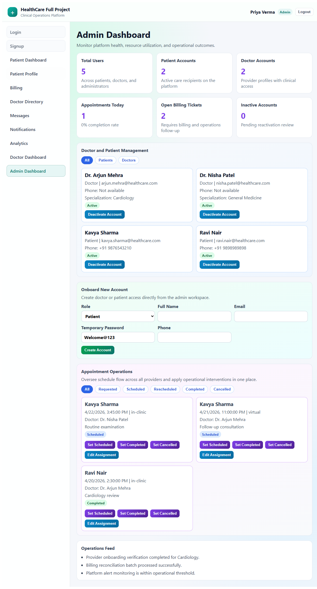


### Patient Experience

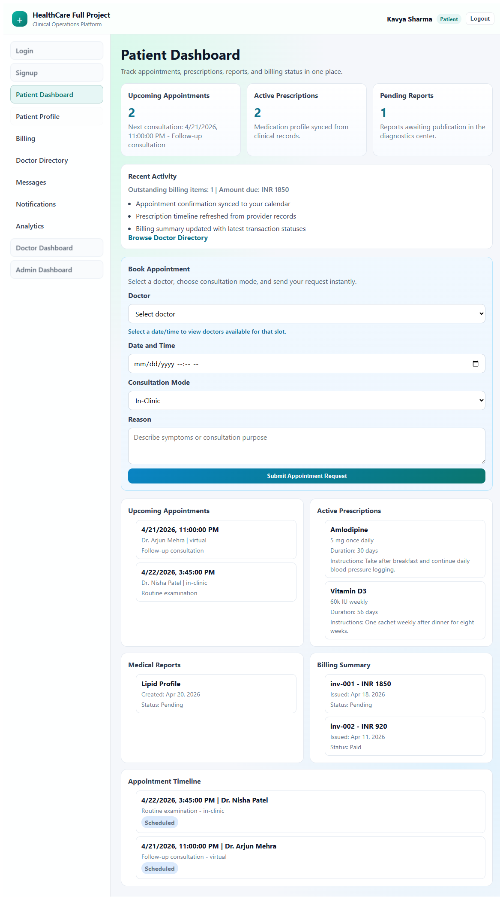
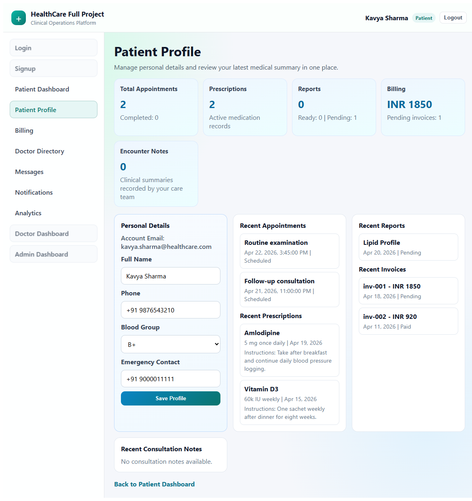
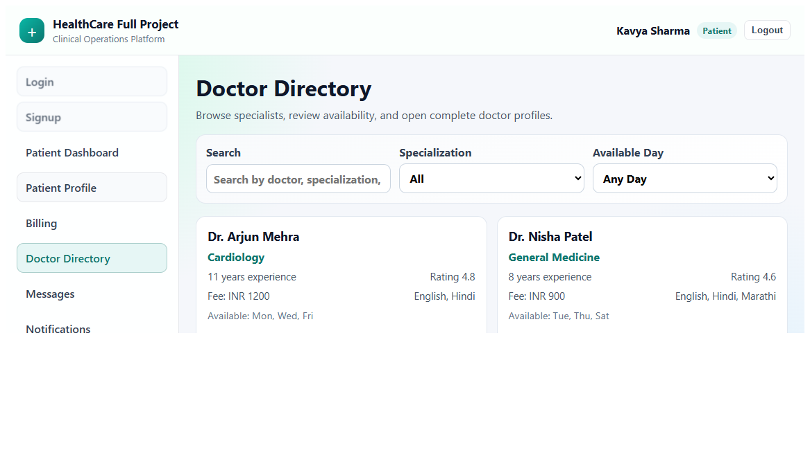
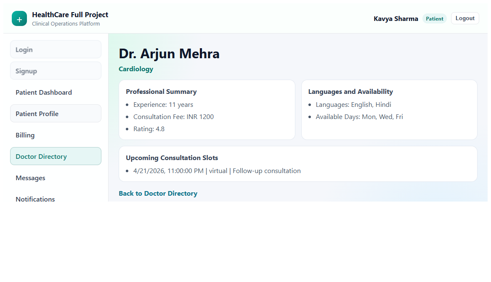
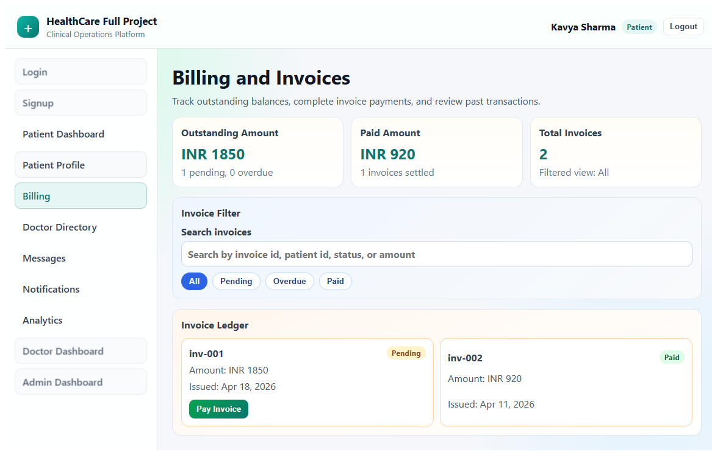
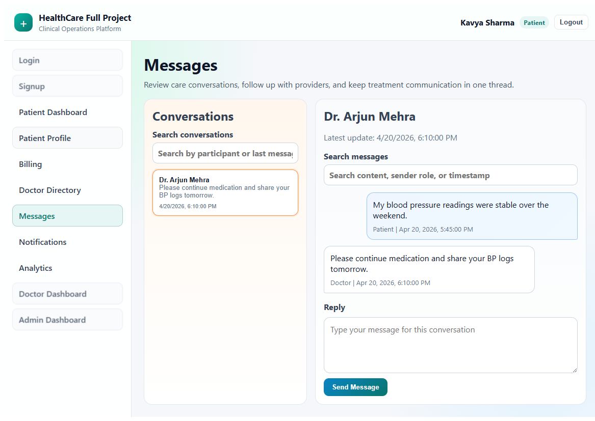
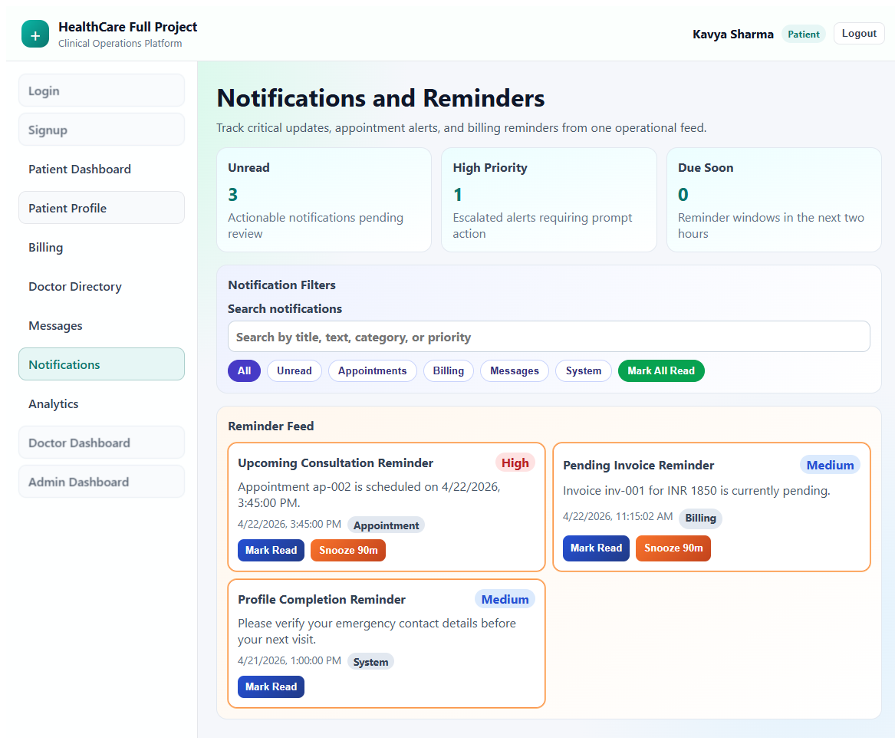
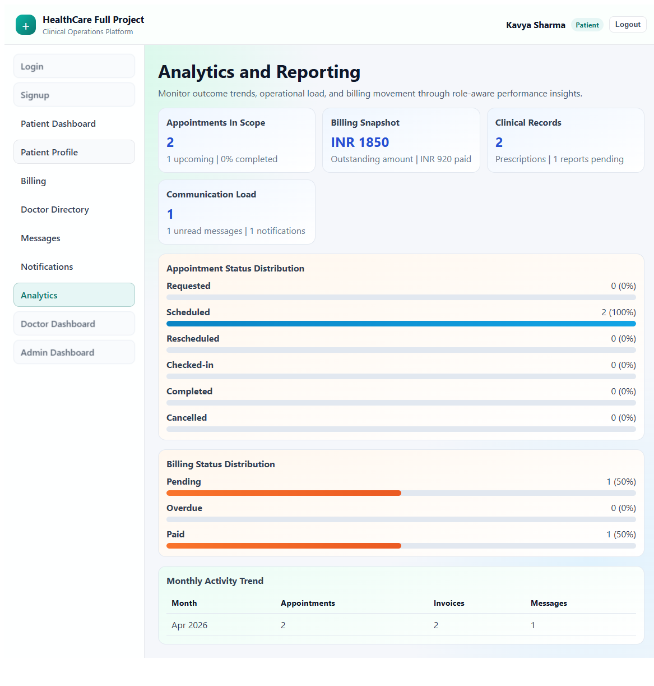

### Doctor Experience

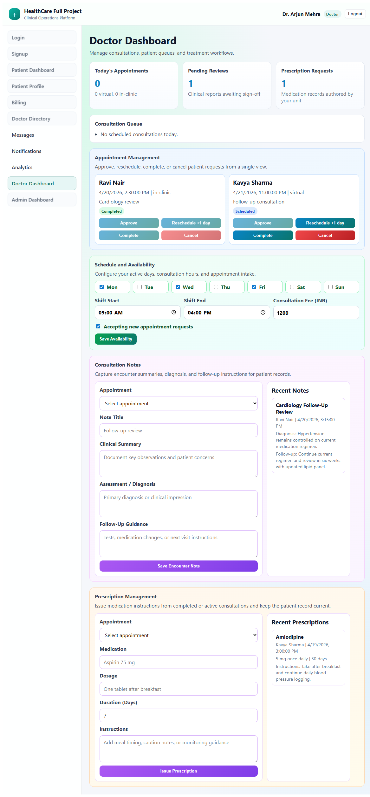
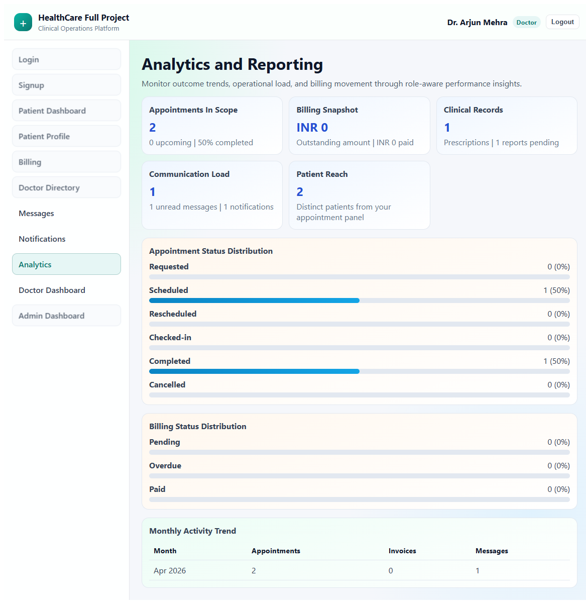

### Admin Experience


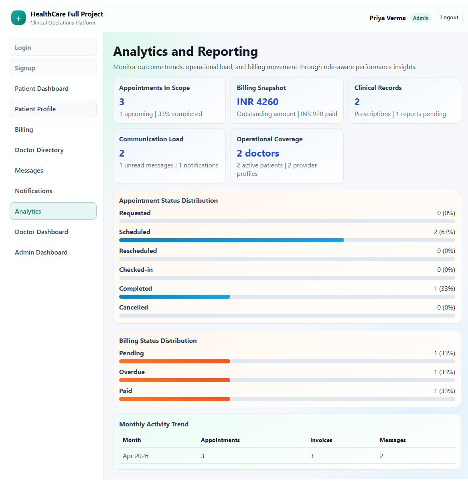

### Fallback Route

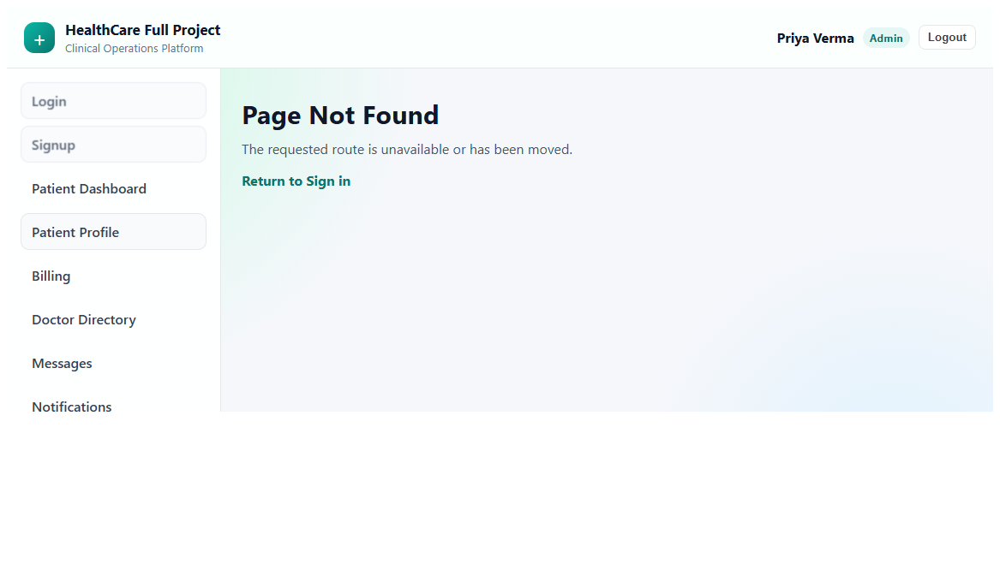

## Final Release Notes

- End-to-end roadmap completed through Step 20
- Feature routes are reachable and role-guarded
- Build passes successfully
- Documentation and screenshot coverage added
- Implementation log expanded in [plan_implementation/healthcare_full_project.md](plan_implementation/healthcare_full_project.md)
